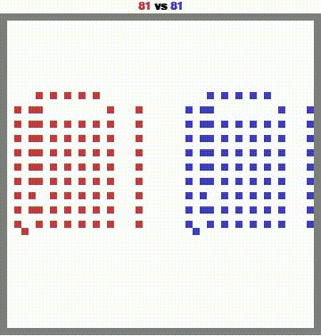
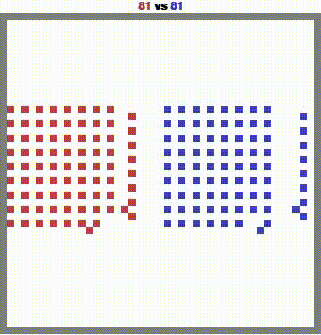

# MAgent2 RL Final Project
## Overview
In this final project, you will develop and train a reinforcement learning (RL) agent using the MAgent2 platform. The task is to solve a specified MAgent2 environment `battle`, and your trained agent will be evaluated on all following three types of opponents:

1. Random Agents: Agents that take random actions in the environment.
2. A Pretrained Agent: A pretrained agent provided in the repository.
3. A Final Agent: A stronger pretrained agent, which will be released in the final week of the course before the deadline.

Your agent's performance should be evaluated based on reward and win rate against each of these models. You should control *blue* agents when evaluating.

<p align="center">
  
  
</p>
This branch is our code for DQN+CrossQ agent (all form).

## Installation
Clone this repo and install with
```
pip install -r requirements.txt
```

## Training
To train best model run : 
```
python train.py
```
The model will have name “blue_cross.pth” and the log will be saved at “log.txt”
## Evaluation
to eval the best model run : 
```
python eval.py
```
## File description
eval.py: evaluate function used in training phase <br>
data.py: set up buffer and create dataloader <br>
test.py: evaluate the win rate of blue and red agent after training <br>
utils.py : some auxiliary functions that control the agent <br>
train.py: you can set up some config for enviroment, call function train from Trainer to run cross_q algorithm 


## References

1. [MAgent2 GitHub Repository](https://github.com/Farama-Foundation/MAgent2)
2. [MAgent2 API Documentation](https://magent2.farama.org/introduction/basic_usage/)

For further details on environment setup and agent interactions, please refer to the MAgent2 documentation.